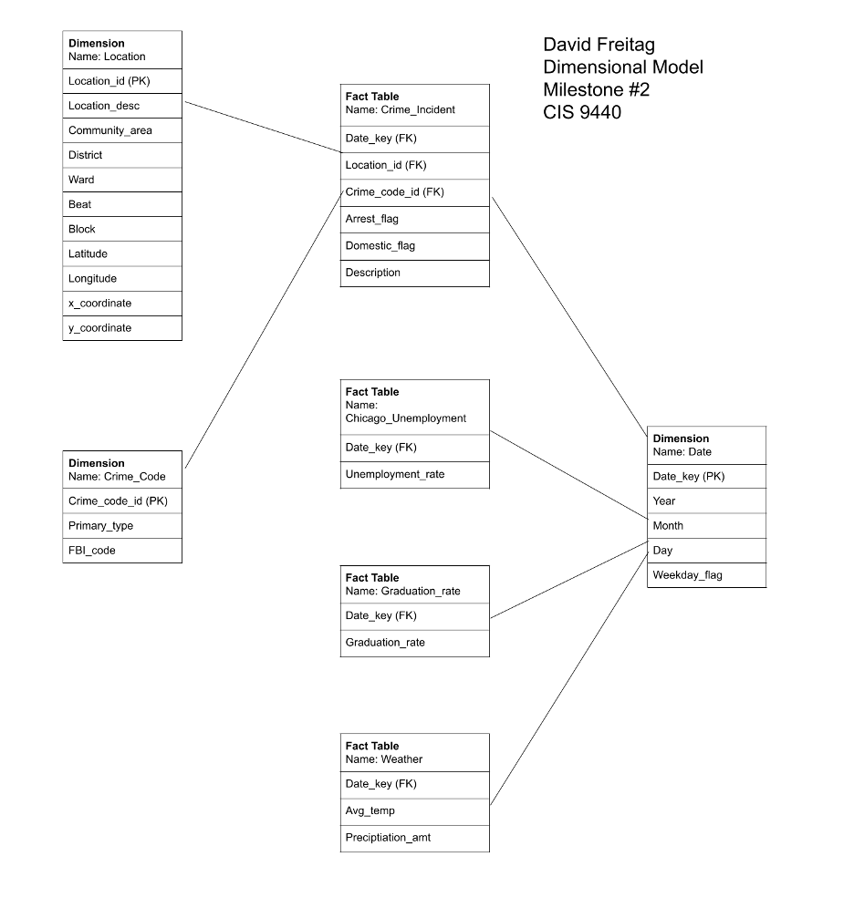
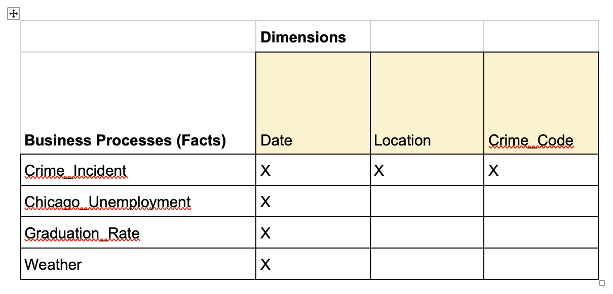
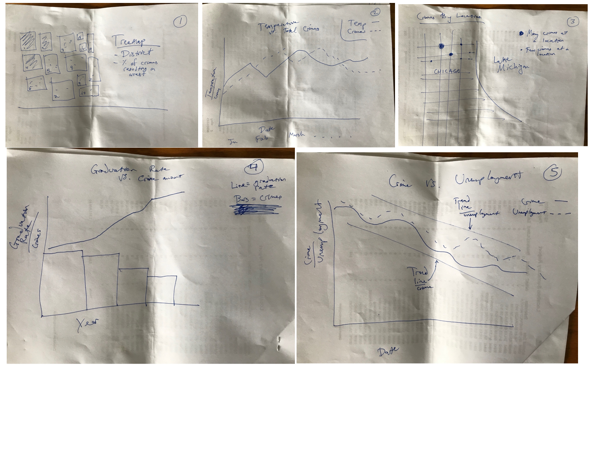
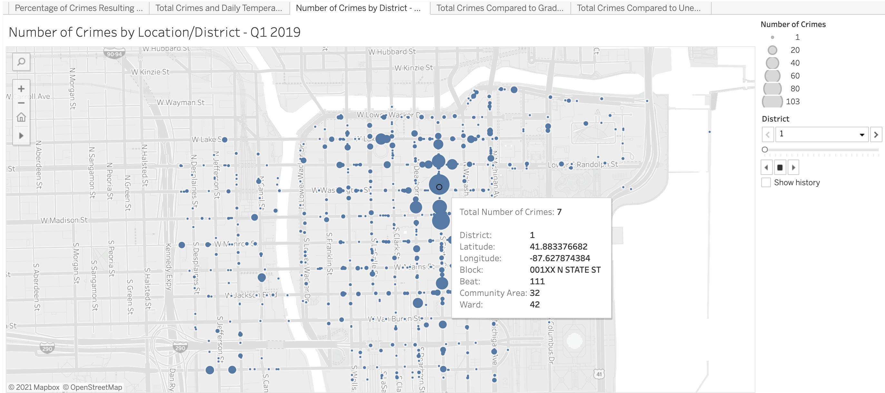

# Crime Intelligence:
## Understanding and Predicting Factors Driving the Incidence of Crime in Chicago

- David Freitag
- 5/13/21
- CIS 9440 - Data Warehousing and Analystics

**Project Objective:**
Follow the Kimball Lifecycle to design and develop a public, cloud-based Data Warehouse with a functioning BI application.

**Project Tools:**
The tools used to build this Data Warehouse were:

1. Data integration (ETL): Python
2. Data Warehousing: Google BigQuery
3. Business Intelligence: Tableau

## Kimball Lifecycle Project Stages

### Project Planning

**Motivation for project:** The ability to predict changes in the crime rate, as well as where those changes will occur, can lead to more effective and efficient deployment of police and security resources to discourage criminal activity.

**Description of the issues or opportunities the project will address:**

Issues presented by crime:

- The crime rate in Chicago results in significant financial cost to taxpayers as a result of
the police department budget.
- Crime in Chicago has an economic cost on crime victims (i.e. theft of property).
- Crime in Chicago has a human cost on victims of crime, the families of those victims, and the families of the perpetrators.
- Crime in Chicago has a human and economic cost for perpetrators who find it challenging to join the job market after their interactions with the criminal justice system.

Opportunities that arise from this project:

- Reduce crime by more effectively deploying police resources to discourage criminal activity.
- Reduce costs of policing through a lower crime rate.
- Reduce the number of people interacting with the criminal justice system.
- Reduce recidivism of past offenders.
- Increased effectiveness of police activities.
- Increased efficiency of use of police resources.

**Project Business or Organization Value:** This project will allow the Chicago Police Department to make informed decisions about where and how to deploy police resources, resulting in a significantly reduced crime rate and the costs associated with that crime.

**Data Sources:**

1. [Chicago Crime Data](https://console.cloud.google.com/marketplace/product/city-of-chicago-public- data/chicago-crime)

2. [Chicago Inflation and Unemployment Data](https://console.cloud.google.com/marketplace/product/bls-public-data/cpi- unemployement)

3. [Chicago Weather Data](https://www.ncdc.noaa.gov/cdo- web/datasets/GHCND/locations/CITY:US170006/detail)

### Business Requirements Definition

List of Data Warehouse KPI's:

1. Percentage of crimes resulting in arrest by location over a time period
2. Total crimes compared to daily temperature over time period
3. Number of crimes by location over a time period
4. Total crimes compared to graduation rate over a time period
5. Total crimes compared to unemployment rate over a time period

### Dimensional Model

This project's Dimensional Model consists of four facts and three dimensions.

This project's Kimball Bus Matrix:

### Business Intelligence Design and Development

List of Visualizations for each KPI:

1. Treemap: percentage of crimes resulting in arrest by location over a time period
2. Comparative line plot: total crimes compared to daily temperature over time period
3. Navigable map with volume bubbles: number of crimes by location over a time period
4. Comparative bar graph/line plot: total crimes compared to graduation rate over a time period
5. Comparative line plot with trend lines: total crimes compared to unemployment rate over a time period

BI Application Wireframe design:

Picture of the final BI Dashboard:

### Deployment

The project was deployed on Tableau Public:
[https://tabsoft.co/3xQjZ9s](https://tabsoft.co/3xQjZ9s)